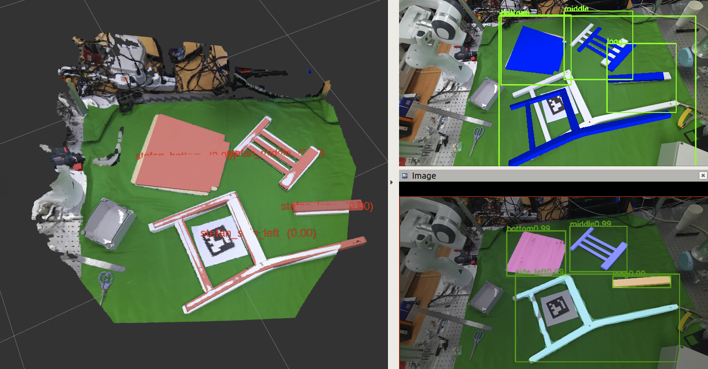

# Assembly Furniture Recognition

## Features
---
- Furniture recognition toolkits for furniture assembly project (IKEA STEFAN)
- Instance segmentation using [Mask R-CNN](https://openaccess.thecvf.com/content_iccv_2017/html/He_Mask_R-CNN_ICCV_2017_paper.html)
- 6d pose estimation using [Augmented AutoEncoder (AAE)](https://openaccess.thecvf.com/content_ECCV_2018/html/Martin_Sundermeyer_Implicit_3D_Orientation_ECCV_2018_paper.html) and [Multi-Path Augmented AutoEncoder (MPAAE)](https://openaccess.thecvf.com/content_CVPR_2020/html/Sundermeyer_Multi-Path_Learning_for_Object_Pose_Estimation_Across_Domains_CVPR_2020_paper.html)




## To Do

- list up ros dependencies

## Getting Started

- tensorflow 1.14
- python 2.7 (local, /usr/bin/python)
- torch 1.3.0
- torchvision 0.4.1
- [azure_kinect_ros_driver](https://github.com/microsoft/Azure_Kinect_ROS_Driver)
- [assemlby_camera_manager](https://github.com/SeungBack/assembly_camera_manager)
- [zivid_ros_driver](https://github.com/zivid/zivid-ros)
- [open3d-ros-helper](https://github.com/SeungBack/open3d-ros-helper)
- assembly part segmentation (This repository is private at the moment)


## Published Topics
---
#### `/assembly/vis_is`
- message type: `sensor_msgs/Image`
- Visualization results of instance segmentation 

#### `/assembly/vis_pe_aae` 
- message type: `sensor_msgs/Image`
- Visualization results of 6d pose estimation from AAE

#### `/assembly/markers/aae` 
- message type: `visualization_msgs/MarkerArray`
- Visualization markers for AAE

#### `/assembly/markers/icp` 
- message type: `visualization_msgs/MarkerArray`
- Visualization markers for AAE + ICP

#### `/assembly/detection/aae` 
- message type: `vision_msgs/Detection3DArray`
- 6d pose estimation results from AAE

#### `/assembly/detection/aae` 
- message type: `vision_msgs/Detection3DArray`
- 6d pose estimation results from AAE + ICP


## How to use
---
### Single Camera Setup (Kinect Azure)
1. launch k4a driver
```
$ ROS_NAMESPACE=azure1 roslaunch azure_kinect_ros_driver driver.launch color_resolution:=720P depth_mode:=NFOV_2X2BINNED fps:=5  tf_prefix:=azure1_
```
2. launch k4a manager 
```
$ roslaunch assembly_camera_manager single_azure_manager.launch target_fiducial_id:="1"
```
3. camera to map calibration 
```
$ rosservice call /azure1/extrinsic_calibration "target_fiducial_ids: [1]"
```
4. 6d object pose estimation using MPAAE
```
$ roslaunch assembly_part_recognition single_azure_mpaae.launch 
```
5. visualization using RVIZ
```
rosrun rviz rviz -d single_azure.rviz
```

## Authors
---
* **Seunghyeok Back** [seungback](https://github.com/SeungBack)

## License
---
This project is licensed under the MIT License

## Acknowledgments
---
This work was supported by Institute for Information & Communications Technology Promotion(IITP) grant funded by Korea goverment(MSIT) (No.2019-0-01335, Development of AI technology to generate and validate the task plan for assembling furniture in the real and virtual environment by understanding the unstructured multi-modal information from the assembly manual.